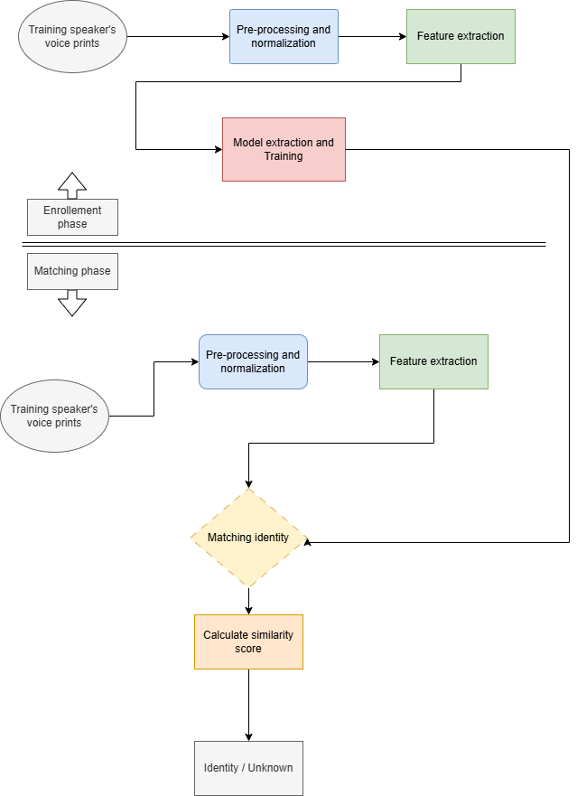
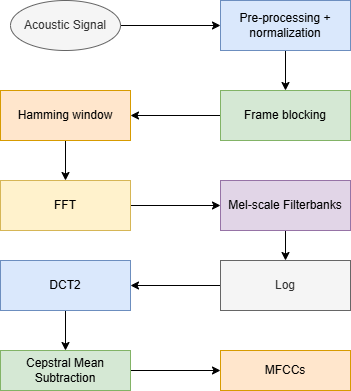

#  Speaker Identification System

This project is a **speaker identification system** based on **MFCC (Mel Frequency Cepstral Coefficients)** feature extraction and a **TDNN (Time Delay Neural Network)** model for classification. It aims to accurately determine the identity of a speaker from an input voice recording.

---

##  Overview

Speaker identification is the task of recognizing who is speaking by analyzing their voice characteristics. This project processes voice recordings through a pipeline that includes feature extraction, model training using a TDNN architecture, and speaker matching.

###  System Flow

The entire speaker identification pipeline is summarized in the diagram below:

---

##  Why MFCC?

MFCCs are a widely used feature set in speech and speaker recognition systems due to their effectiveness at capturing the timbral aspects of human voice, which are key for distinguishing speakers.

###  Benefits of MFCC:
- Mimics the human auditory system using the Mel scale
- Captures perceptually relevant features of speech
- Low-dimensional yet information-rich representation
- Robust to noise in many real-world environments

---

##  How MFCC Works

The MFCC feature extraction process transforms a raw audio signal into a set of coefficients that represent the short-term power spectrum of sound. Here's how the pipeline works:

###  Steps:
1. **Pre-processing + Normalization**: Removes DC offset and normalizes the signal.
2. **Frame Blocking & Windowing**: Segments signal into frames and applies a Hamming window.
3. **FFT**: Converts each frame from time to frequency domain.
4. **Mel Filter Banks**: Emphasizes frequencies relevant to human hearing.
5. **Log & DCT (DCT2)**: Reduces dimensionality and decorrelates features.
6. **Cepstral Mean Subtraction**: Improves robustness by reducing noise.
7. **Output**: A compact set of MFCC features.

---

##  Model Architecture: TDNN-Based Speaker Identification

We use a **TDNN (Time Delay Neural Network)** to model the temporal dependencies in speech, which helps capture the speaker's unique voice characteristics.

###  Why TDNN?
- Efficiently handles variable-length inputs
- Captures long-range dependencies in the signal
- Proven performance in speaker verification and recognition tasks

The TDNN is trained on the MFCC features extracted from audio recordings during the enrollment phase. During the matching phase, the input features are passed through the same pipeline and compared to enrolled speaker models.

---

##  Phases

1. **Enrollment Phase**: Register known speakers' voiceprints.
2. **Matching Phase**: Identify input speaker by comparing with enrolled data.

The system calculates a **similarity score** to determine the identity or return "Unknown" if confidence is low.

---

##  Future Improvements
- Add voice activity detection (VAD)
- Use x-vectors for speaker embeddings
- Enhance with real-time inference capabilities

---

##  Diagrams

- `flow.png`: Speaker identification process overview
- `mfccdiag.png`: MFCC feature extraction pipeline

---

##  Author

Built by Akram — full-stack developer passionate about voice tech and deep learning.

---

##  License

This project is licensed under the MIT License.
